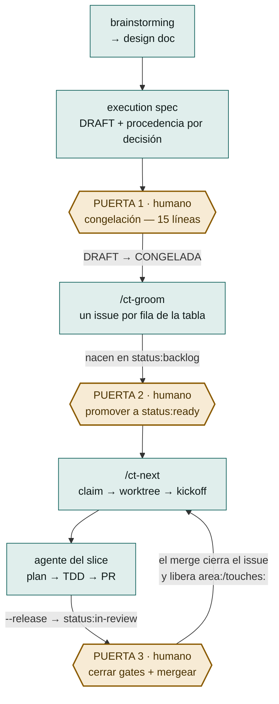
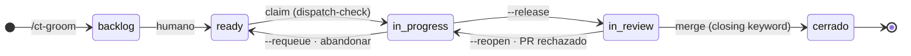

# Control Tower Loop

**Un ciclo de desarrollo con agentes en el que la máquina despacha y verifica, y el humano decide exactamente tres veces.**

Control Tower es un plugin de [Claude Code](https://code.claude.com/docs) que convierte un spec congelado en issues de GitHub, despacha cada uno a un agente aislado en su propio worktree, y lleva la cuenta de quién está trabajando en qué, qué ha entregado y qué es residuo. Lo que no hace —a propósito— es decidir: congelar el spec, promover un slice a la cola y mergear siguen siendo actos humanos.

No es un orquestador de agentes en paralelo. Es lo contrario: una máquina para **no** paralelizar lo que está acoplado, y para que lo que sí es independiente avance sin que nadie tenga que acordarse de nada.

| | |
|---|---|
| Versión | `0.32.0` · contrato de la tabla de slices `v16` |
| Comandos | `/ct-init` · `/ct-groom` · `/ct-next` · `/ct-status` |
| Puertas humanas | 3 — congelación, `status:ready`, merge |
| Skills | 11, forkados de superpowers 6.0.3 |
| Requisitos | Node ≥ 24 · `gh` autenticado · `cmux` · git worktrees |
| Licencia | MIT |

> ### 📘 La referencia completa
> Este README es la vista de conjunto. El documento largo —los 16 pasos uno a uno, la máquina de estados, y el **formato exacto de los 11 artefactos** que viajan entre pasos— está en [`docs/loop/`](docs/loop/):
>
> - **[control-tower-loop.pdf](docs/loop/control-tower-loop.pdf)** — 29 páginas, para leer y compartir
> - **[control-tower-loop.html](docs/loop/control-tower-loop.html)** — página autocontenida, un solo fichero, sin dependencias de red

---

## El problema que resuelve

Cuando un agente implementa una tarea, funciona. Cuando son seis a la vez sobre el mismo repo, lo que falla no es la implementación: es todo lo que la rodea.

- **Dos agentes tocan el mismo fichero** y el segundo ramifica de una base que no contiene el trabajo del primero.
- **Un agente termina y nadie se entera**, porque «terminado» no es un estado observable desde fuera.
- **Un PR se mergea y su issue se queda abierto**, así que el trabajo que dependía de él espera para siempre.
- **Un agente se muere** dejando worktree, rama y ventana de terminal en su sitio, de modo que todas las señales siguen diciendo «vivo».
- **El humano se convierte en el bus de mensajes**: recuerda quién iba por dónde, qué falta revisar y qué se puede lanzar ya.

Control Tower ataca eso convirtiendo cada una de esas cosas en estado explícito —labels de GitHub, ficheros en `.agent/`, worktrees con nombre determinista— y en comprobaciones que se niegan a mentir cuando no pueden verificar algo.

## El ciclo



Hay **dos sesiones vivas por repo, con papeles opuestos**: la *coordinadora*, en el checkout principal, que groomea, despacha, revisa y mergea; y una sesión *despachada* por slice, en `.worktrees/<n>`, que implementa lo suyo y para. Ninguna de las dos hace el trabajo de la otra, y cada una lo lleva escrito en un campo `role` de su fichero de estado — no en un prompt, que se pierde al re-hidratar.

### Las tres puertas, y por qué existen

| Puerta | Cuándo | Por qué no la puede cerrar la máquina |
|---|---|---|
| **1 · Congelación** | El spec está escrito, en `DRAFT` | Nace de una frase real: *«yo no me suelo leer los specs»*. Si el humano no lee el spec, quien lo escribe podría cerrar decisiones con firma ajena. Se presentan **15 líneas** —hipótesis, cada decisión con su procedencia, anti-scope— y se para. El OK muta `DRAFT → CONGELADA`. **Sin congelación no hay groom.** |
| **2 · `status:ready`** | Los issues ya existen | `/ct-groom` los crea en `status:backlog`, nunca en `ready`. Que un slice esté escrito no significa que se deba empezar ahora. |
| **3 · Merge** | El PR está abierto y el claim liberado | El loop **escribe y enseña** los gates (`visual`, `apply`) pero no impide mergear con uno sin cerrar. Y el merge es lo único que libera los tokens de área y satisface las dependencias. |

### El modelo de dos niveles

Control Tower es el patrón de desarrollo dirigido por subagentes **un nivel por encima**: la tabla de slices es el fichero de plan, `/ct-next` es el coordinador, la sesión despachada es el implementador, y la revisión humana del PR es el *two-stage review*. Dentro del worktree, un nivel más abajo, corre el conjunto entero de skills — `writing-plans`, `subagent-driven-development`, `test-driven-development`, `systematic-debugging`. El mismo patrón, dos escalas.

## Instalación

```
/plugin marketplace add josemerca/control-tower-plugin
/plugin install control-tower-loop@control-tower
```

> El atajo `owner/repo` clona por SSH por defecto; si prefieres HTTPS, exporta `CLAUDE_CODE_PLUGIN_PREFER_HTTPS=1`.

Luego, **una vez por repo que quieras gobernar**:

```
/ct-init
```

El scaffolder deja `.agent/STATE.md`, la sección del contrato de la tabla de slices dentro de `AGENTS.md`, y dos líneas en el `.gitignore`. No planifica nada: rellenar los comandos reales del repo (build, test, lint, CI) en `AGENTS.md` es cosa tuya.

Si `/ct-init` avisa de que el repo **ya traía sus propias convenciones** —otro protocolo de claim, otra ruta de worktrees, otro fichero de estado—, eso no lo resuelve el plugin: elegir cuál manda es una decisión tuya.

### Qué necesita el entorno

- **Node ≥ 24** (los tres ejecutables son ESM y los hooks se bundlean con esbuild).
- **`gh` autenticado** contra el repo: todo el estado vive en issues, labels y PRs de GitHub.
- **`cmux`** en el `PATH`: es quien abre el terminal de cada agente despachado. `/ct-next --dry-run` comprueba que esté, sin ejecutarlo.
- **Un Project v2 con un campo de iteración llamado exactamente `Sprint`**, sólo si usas `/ct-groom --project`.

## Los cuatro comandos

| Comando | Qué hace | Muta |
|---|---|---|
| **`/ct-init`** | Prepara un repo para el loop: estado, contrato en `AGENTS.md`, `.gitignore`. Detecta convenciones propias del repo que contradigan al loop. | el repo local |
| **`/ct-groom`** | Lee la tabla de slices del spec **congelado** y crea milestone, labels, issues y altas en el Project. Idempotente por existencia; detecta divergencia pero **no la aplica** sin `--reconcile`. | GitHub |
| **`/ct-next`** | Elige el siguiente slice despachable (orden, dependencias mergeadas, sin colisión de tokens, con hueco de `--cap`), lo reclama, crea worktree y rama, siembra el estado y lanza al agente **verificando que arrancó de verdad**. | GitHub + disco |
| **`/ct-status`** | Responde de una vez: qué está en vuelo, qué ha entregado y qué es residuo. **No escribe una sola vez** — hay un test que lo comprueba mirando el `argv` real con el que se llamó a `gh`. | nada |

Los cuatro comparten convención de canal: **stdout es el producto** (el plan, la selección, el informe, el motivo de bloqueo) y **stderr es el diagnóstico** (`aviso:`, `ATENCIÓN:`, y todo aborto). Y una gramática de códigos de salida con tres estados: hecho, no se pudo comprobar, queda algo pendiente. Están todos tabulados en [la referencia completa](docs/loop/control-tower-loop.pdf).

Empieza siempre en seco:

```bash
/ct-groom --dry-run      # valida EXACTAMENTE lo mismo que la corrida real
/ct-next  --dry-run      # comprueba lo que el run real necesita, e imprime el kickoff en prosa
```

## El estado de un slice es una label

No hay base de datos. El estado son las labels del issue, y el timeline de GitHub registra cada transición con su timestamp — así sobrevive a un `/clear`, a un redespacho y a otra máquina.



La asimetría que explica la mayoría de los bloqueos reales:

| | `status:in-progress` | `status:in-review` |
|---|---|---|
| Ocupa `--cap` | sí | **no** |
| Retiene `area:` / `touches:` | sí | **sí, hasta el merge** |
| Satisface un `merge-after` | no | no — hace falta cerrar como *completed* |

Es decir: **un PR sin mergear frena a sus vecinos de área aunque no haya ningún agente corriendo.** El `--release` libera la plaza de agente, no el terreno.

## Lo que viaja entre pasos

El principio que ordena todo el diseño:

> **Lo que escribas fuera de la tabla de slices y de `## Contexto del epic` no llega al agente.** El agente que implementa un slice no recibe el spec: recibe un prompt de arranque y el cuerpo del issue. Una exigencia escrita en otra sección es invisible por muy contundente que esté redactada.

| Artefacto | Quién lo escribe | Dónde vive |
|---|---|---|
| Design doc | brainstorming | `docs/superpowers/specs/*-design.md` |
| **Execution spec** | brainstorming | `docs/superpowers/specs/*-execution.md` |
| **Tabla de slices** | el autor del spec | § del execution spec — lo único que un programa parsea |
| Cuerpo del issue | `/ct-groom` | GitHub |
| Labels | `/ct-groom` | GitHub |
| Kickoff | `/ct-next` | prompt efímero + launcher temporal |
| `SLICE.md` | `/ct-next` siembra, el agente escribe | `.worktrees/<n>/.agent/` — **ignorado por git** |
| `STATE.md` | `/ct-init`, la coordinadora | `.agent/` — trackeado |
| Plan del slice | el agente, con `writing-plans` | `docs/superpowers/plans/` — commiteado, viaja en el PR |
| PR | el agente | GitHub — con la closing keyword en el **cuerpo** |
| `conventions-ack.md` | el humano | `.agent/` — silencia un aviso sin borrar documentación |

**El formato exacto de cada uno está en [la referencia completa](docs/loop/control-tower-loop.pdf)**, sacado en cada caso de la función que lo emite, no de una descripción.

### Las 4 reglas de celda de la tabla de slices

Van en la plantilla del spec y no en el contrato, porque **las juzga un humano al congelar, no un parser**:

1. **Clarificado = convergencia.** Una fila está lista cuando dos lecturas independientes convergen en el mismo desenlace.
2. **`Acepta` = postcondiciones, no acciones.** «El token caducado deja la sesión en login», no «se refresca el token».
3. **`Gate` = residuo de los `Acepta`.** Lo observable que *no* puede tener test 1:1 es exactamente donde entra el humano.
4. **`Dep` declara interfaz.** *La más importante.* La `Entrega` de una fila con `Dep` nombra **qué consume** de la anterior. Un `Dep` que sólo dice `#2` es un solape sin declarar, y el solape sin declarar es lo que hace que las reviews se rechacen.

## Desarrollo

```bash
npm install
npm test            # construye dist/ y corre la suite (vitest)
npm run build       # sólo el bundle de los hooks
```

### La regla del `dist/`

`hooks/hooks.json` arranca `dist/session-start.js`, `dist/stop.js` y `dist/commit-keyword-guard.js` — **los bundles, no los fuentes de `hooks/`**. `dist/` está trackeado, así que:

> **Todo cambio en `hooks/`, o en cualquier módulo de `scripts/` que esos hooks importen, tiene que llevar un `dist/` reconstruido en el mismo commit.**

Si no, el repo sigue distribuyendo el hook viejo mientras la fuente ya dice otra cosa — y la suite se queda **en verde**, porque `npm test` construye primero: prueba un `dist/` recién hecho mientras el commiteado se pudre. Pasó de verdad. Antes de commitear algo que toque `hooks/`: `npm run build`, y mira el diff de `dist/*.js` como parte del cambio.

### Estructura

```
commands/     los cuatro slash commands (Markdown + prosa larga: son la documentación)
scripts/      la lógica — módulos puros y los tres ejecutables .mjs
hooks/        SessionStart (hidratación), Stop (estado al día), PreToolUse (guarda de commits)
dist/         bundles de los hooks — DERIVADO, trackeado, ver arriba
skills/       los 11 skills forkados + LICENSE-superpowers + FORK.md
__tests__/    62 ficheros, 1.745 tests
docs/loop/    el documento del ciclo: fuente, HTML autocontenido y PDF
docs/         los handoffs de cada ronda (prompt-fNN-*.md) — cómo se llegó hasta aquí
```

### El fork de superpowers

Los skills de `skills/` (salvo `state-template`, propio) son un fork de **superpowers 6.0.3** (Jesse Vincent, MIT — ver [`skills/LICENSE-superpowers`](skills/LICENSE-superpowers)), invocables como `control-tower-loop:<nombre>`. Se forkaron los 11 que se usaban de verdad, medido sobre 2.704 transcripts.

**Tres costuras están reescritas y no se pisan en un cherry-pick** (las vigila `__tests__/skills-fork.test.js`):

1. `brainstorming` — su estado terminal ya no es invocar `writing-plans`: es escribir el execution spec y **pedir la congelación**.
2. `subagent-driven-development` — la rama «no hay plan» ya no manda a brainstormear: manda a escribir el plan ahora, scoped al issue.
3. `finishing-a-development-branch` — paso 0: si existe `.agent/SLICE.md`, **no hay menú**. PR + `--release` + parar. El merge es humano.

Los detalles y el procedimiento de cherry-pick están en [`skills/FORK.md`](skills/FORK.md).

## Límites conocidos

Escritos aquí porque un límite dicho es operable y uno implícito no.

- **El claim no es atómico.** El lock con el que se reclama un issue son labels de GitHub, sin compare-and-swap. Está **reproducido y verificado**, no sospechado, que dos dispatchers lanzados casi a la vez pueden reclamar el mismo token y arrancar los dos. La mitigación es operativa: **no lances dos `/ct-next` a la vez contra el mismo repo.**
- **Nada vigila los claims entre invocaciones.** El claim es una label, sin heartbeat. Y la evidencia de vida es local a la máquina, así que nunca se afirma «abandonado», sólo «aquí no hay ni rastro».
- **Los gates se enseñan, no se imponen.** El loop no impide mergear con un gate sin cerrar.
- **No hay transacción en el groom.** Superada la validación, un fallo de red deja creado lo anterior. No hay rollback y no se finge que lo haya: de un abort a mitad se sale volviendo a correr, no limpiando a mano.
- **`--reconcile` es experimental** y lo avisa cada vez. La mitad de *detección* (que nunca escribe) está mejor entendida que la mitad de *aplicación*.
- **La medida está pre-registrada, no cosechada.** El timeline de GitHub ya registra cada transición con su timestamp: media instrumentación existe sin recoger.

Y el criterio de muerte del proyecto, que sigue vigente: **si el loop cuesta más intervención humana de la que ahorra, se dice y se para.** Eso también sería un resultado.

## Licencia

MIT. El fork de superpowers conserva su licencia MIT original en [`skills/LICENSE-superpowers`](skills/LICENSE-superpowers).
